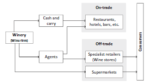

# A hedonic price analysis for the Portuguese wine market: Does the distribution channel matter?
Authors : João Rebelo, Lina Lourenço-Gomes, Tânia Gonçalves and José Caldas  
Year : 2018

## Research objective
The main goal of this paper is to investigate the determinants of wine prices in the Portuguese market in different distribution channels, using a hedonic price approach.
Two channels are considered: 
1. a specialist retailer 
2. a large supermarket chain with shops all over Portugal.

## Findings
We conclude that the wine market is heterogeneous, and the importance of the various price determinants differs between distribution channels and, in the case of the specialist retailer, throughout the conditional statistical distribution
of the price.

## Suppositions
1. There is not one wine market, but several wine markets with different critical factors (price, taste and brand), and consumers may make their choice according to the type of wine, its age, colour or geographical origin, amongst other factors.
2. Consumers link wine prices to a quality indicator (Williamson, Lockshin, Francis and Loose, 2016).
3. There is a diverse range of market distribution channels. 
In general, wines in lower price segments are concentrated in hypermarkets, supermarkets and discount stores (grocery retailing), whereas the higher priced segments are marketed at on-trade (restaurants, hotels, bars, etc.) and in specialist shops.

## Background and previous studies
1. The special role of distribution channels in determination of wine prices in line with the recent hedonic analyses and quantile regressions (Di Vita et al., 2015; Caracciolo et al., 2016).
2. Nevertheless, most of the hedonic price function studies rely on the assumption that the prices of wine attributes do not vary with distribution channel (Combris, Lecocq, and Visser, 1997, 2000; Landon & Smith, 1997, 1998; Schamel, 2009; Panzone & Simões, 2009; Caldas & Rebelo, 2013; Oczkowski, 1994, 2016; Asgari and Reed, 2016).
3. Numerous studies have shown that wine price is strongly determined by the objective attributes, e.g., Oczkowski (1994), Combris et al. (1997, 2000), Angulo, Gil, Gracia, and Sanchez (2000), Luppe and Angelo (2005), Haeger and Storchmann (2006), Lecocq and Visser (2006), San Martin, Troncoso, and Brummer (2008), but these studies did not analyse quantity supplied or environment variables as potential price determinants.
4. The inclusion of quantity is justified by several studies suggesting that when crops are small wine prices tend to increase (Costanigro, McCluskey, & Mittlehammer, 2007; Carew & Florkowski, 2008; Benfratello, Piacenza, & Sacchetto, 2009; Kwong, Cyr, Kushner, & Ogwang, 2011).
5. The impact of bio/environmental variables (use of eco-friendly viticulture) on wine prices has also been addressed by several authors (Delmas & Grant, 2014; Kwong et al., 2011; Roma, Di Martino, & Perronne, 2013) who have stated that since it is more expensive to produce grapes organically than using conventional methods, organic producers should be paid a premium.
6. The evidence on the role of sensory variables in price formation literature is inconclusive.
7. There is a considerable body of research on the impact of reputation on wine prices and consumers’ choices, studies by Oczkowski (2001), Ling and Lockshin (2003), Schamel (2009), Castriota and Delmastro (2008, 2009), Benfratello et al. (2009), Gergaud, Livat, and Warzynski (2012) and Frick and Simmons (2013) confirmed that there are reputation effects.
8. Brentari, Levaggi, and Zuccolotto (2011) carried out interesting research on pricing of Italian red wine in the domestic market during 2007–2008 using a hedonic price function. They showed that price formation followed quite different patterns in large-scale retailers and specialist wine shops. In the former, price was mainly dependent on the characteristics described on the wine’s label. Di Vita et al. (2015) confirmed that sale location plays a very important role in wine pricing, highlighting the price premium that high-end wines attract when sold in specialist wine shops. Caracciolo et al. (2016) corroborated this result, stating that wine shops and discount stores represented diametrically opposite sales methods.

## Suppositions on market structure
The difference between value and volume market shares indicates that the average consumer price is lower in the off-trade channel, presumably reflecting the smaller number of intermediaries between winery and consumer and the higher mark-ups in the on-trade channel.

## Data
In order to estimate the hedonic price function, data were gathered on domestic retail prices (euro per 75 ml bottle) for still Portuguese wines (red, white and rosé) sold through two distribution channels: 
1. The specialist retailer “Garrafeira Nacional” (N = 1,722 observations; www.garrafeiranacional.com, on 24th November, 2017), which sells through bricks-and-mortar outlets and online; 
2. The ‘Continente’ supermarket chain, a large
chain with shops throughout Portugal (N = 725 observations; 3 January 2018).  
Data on the following objective attributes were collected: alcohol content, age and colour defined by a
dummy for red, being the white/rosé as the baseline. 
Sensory attributes were operationalised as awards/medals won and reputation as origin region (3 regional dummies for Douro, Verdes and Alentejo), producer type (cooperative or private firm) and the wine category (Reserve; other).

## Model
Assuming that the wine prices can be considered not only on average, but also in the tails of the conditional distribution, quantile regressions are applied considering distinct price segments. 
Compared with standard regression modelling, quantile regression provides a better understanding of the role of product attributes at different quantiles of the sample price distribution, by analysing different points of the conditional distribution.

## Estimates
1. For the specialist retailer, the quantitative objective variables alcohol content and age are positive determinants of price in all wine price quantiles and for the full sample, whereas colour (red) is only a positive determinant in the case of the most expensive wines (50-quantile and 75-quantile). 
The awards/medals variable, used as a proxy for sensory attributes, has a positive effect on price in all wine segments. 
Turning to reputation variables, the Douro region influences positively all price segments; producer type (cooperative) is only a determinant (negative) of price in the case of the cheapest wines, as well as for the full sample; Reserve status only has a positive effect on price in low-priced wines.
2. For the supermarket, the results show that the objective attribute alcohol content has a positive influence on price in all wine segments. 
Age has a positive impact in the low-price segments (25-quantile), an effect that is transmitted to the whole sample. 
Colour is not a determinant of price in the OLS, but the quantile regression suggests that red colour has a negative effect on the price of the cheapest wines. 
Awards/medals is a positive influence of the price of the most expensive wines (75-quantile), and also of the whole sample. 
Regarding the wine origin, only the Alentejo region does not have a significant influence on the price.
Finally, the cooperative producer type plays a negative effect on all segments of the price and an opposite effect is witnessed for Reserve wine.